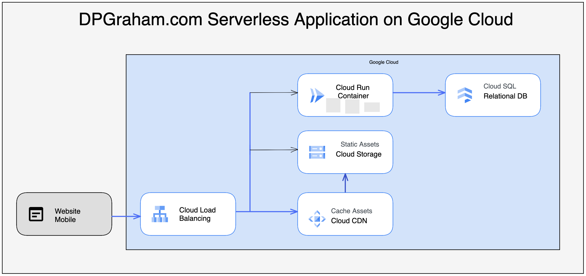

# System Architecture

This section covers our implementation of dpgraham.com on Google Cloud Platform (GCP).

## GCP Architecture

Currently, we employ the following GCP services:

1. Cloud Run
2. Cloud SQL
3. GCP Artifact Registry
4. Cloud CDN
5. Cloud DNS
6. Cloud Storage
7. Cloud Load Balancing

Those components all put together somewhat follows the below basic diagram I whipped up in 5 minutes.

